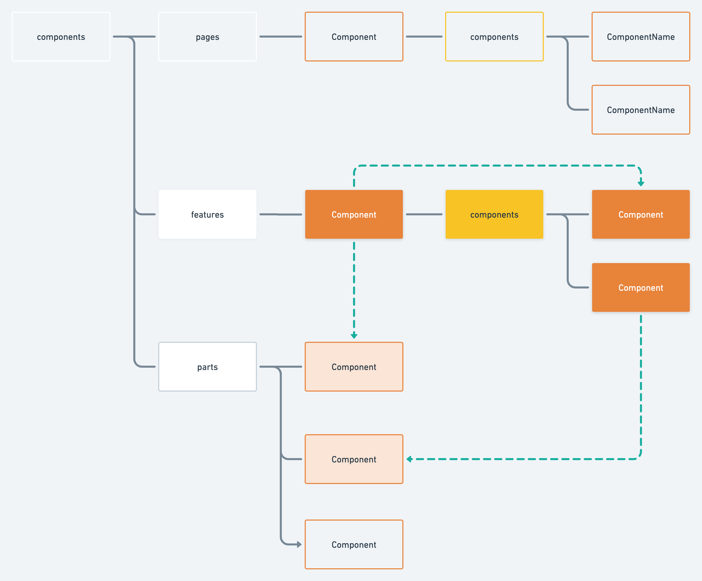

# 📁ディレクトリ構成

ディレクトリ構成もまた自由度が高くプロジェクトの保守性に関係し、コンポーネントの設計と密接に関係があります。

したがって、本稿では
* ディレクトリで利用するコンポーネント
* 依存関係
* それらの理由

といった視点から整理していきます。

こちらが早見表です。
|          | ディレクトリルートに配置するコンポーネント             | 子ディレクトリ(components)   | 子ディレクトリに配置可能なコンポーネント           | 依存関係(参照先)                    |
| -------- | --------------------------------- | --------------------- | ------------------------------ | ---------------------------- |
| parts    | parts-component                   | なし<br>(肥大化する場合例外的にあり) | parts-component                | parts<br>(例外：子ディレクトリ)        |
| features | model-component<br>view-component | あり                    | 任意                             | parts<br>子ディレクトリ             |
| pages    | model-component<br>view-component | あり                    | 任意(第１子階層はmodel-component推奨) | features<br>parts<br>子ディレクトリ |
|          |                                   |                       |                                |                              |


## 基本
まず初めに、各コンポーネントのベースがこちらになります。


コンポーネントはフォルダごとに管理され、その中に各ファイルが機能ごとに分かれています。  

`Component.tsx` にコンポーネント設計でお伝えした構成のいずれかが入り、`model-component` などの場合はHooksが切り出される形です。  
`index.ts` が用意されている理由はimportの冗長化を防ぐためです。Typescriptはフォルダ直下のindex.tsを省略し参照することができます([Barrel](https://typescript-jp.gitbook.io/deep-dive/main-1/barrel))。  
こちらは、`Component.tsx`の内容をそのまま`index.ts`に記述したいという考え方の方もいるかもしれません。エディタの検索性向上のため本リポジトリではこちらの方式をとっていますが、プロジェクトに応じて変更してください。

以後オレンジ色のComponent図形が現れた場合、上記のファイルを包含するものとしてお読みください。


## parts

その名の通り、グローバルに利用される `parts-component` を格納する場所です。

`Input` や `Button` など、汎用性の高いものが配置されます。すべてのコンポーネントフォルダはpartsフォルダ直下に配置されるため、平たい構造となります。

partsコンポーネントは「汎用的な再利用性」が求められるため、依存は同一階層のpartsコンポーネントのみです。
これは
* 状態を持たないpropsリレーであれば再利用性が損なわれないこと（再利用性が維持できること）
* model-componentなどの状態を持つコンポーネントに依存したとたん再利用性が消えること（再利用性の消失を防ぐこと）

が理由となります。

複雑性が増すためatomic designにおけるatoms, molecules, organisms相当のディレクトリは用意していません。  
コンポーネントが増加し管理しにくい際は、機能で分けた `Inputフォルダ`・`Buttonフォルダ`などを作ると良いかもしれません。


## features

再利用される「機能」を集めるディレクトリです。[bulletproof-react](https://github.com/alan2207/bulletproof-react)の設計思想を参考にしています。  
具体的な例を挙げるとプロフィールで、ヘッダーやフッター、グローバルメニューなどを含めても良いかもしれません。カウンターなどの`機能`も(あまり使用例が思いつきませんが) `features`ディレクトリに入れて良いでしょう。

`features`ディレクトリでは基本的に`model-component` を利用します。特定の機能であることから外部との接続・ロジック・状態管理が発生するためです。

プロフィールですと

1. Hooks
   * 顔画像の取得、名前の取得
2. JSX部分
   * 画像を受け取って表示するコンポーネント
     * (画像をアップロードするモーダルコンポーネント)
   * 名前を受け取って表示するコンポーネント

という形になりそうです。

* 状態を持たない、再利用性がある →  `partsディレクトリ` に `parts-component` 
* API通信や状態がある、ロジックがある、再利用性がある → `featuresディレクトリ` に `model-component`など

という切り分けをしましょう。
<br>
<br>

featuresディレクトリのコンポーネントは機能単位であることから肥大化が予想されます。  
これは上で例に挙げたプロフィールの「クリック時の画像アップロードモーダル」に焦点を当てるとわかりやすいでしょう。

プロフィールを細分化すると
* 画像
* 名前
* アイコンアップロードモーダル

などに分けられます。これを1つの `.tsx` ファイルにまとめてしまうと視認性が低下します。
そのため`featuresディレクトリ` には **子の `componentsディレクトリ`** が用意されており、その機能で利用されるコンポーネントの細分化が想定されています。

- `features`
  - `Profile`
    - `components`
      - `Icon`
      - `Name`
      - `UploadModal`

とすると視認性が上がりそうです。

記事一覧の例もわかりやすいかもしれません。
1. features直下で `ArticleList` を `model-component` で作る
2. `子componentsディレクトリ` に `ArticleItem` を `parts-component` で作成し、親からpropsを受け取って表示する

という構成が予想されます。

`子componentsディレクトリ`の狙いは、
- 子コンポーネントを切ることにより視認性を保ちつつ機能を小さな単位にまとめる
- グローバルへのコンポーネントの露出を防ぐ

であることを抑えてください。  
この考え方はこちらの記事における「限定的コンポーネント・横断的コンポーネント」の概念を掴んでいただくとより理解が深まると思います。
[AtomicDesign 境界線のひき方](https://zenn.dev/takepepe/articles/6978c067faab9e7d33c2)
<br>
<br>

依存、参照先はcomponentsディレクトリかpartsディレクトリです。  
同一階層の参照はプロジェクトごとに決定しましょう。基本的には同一階層は参照せず単一機能とし、pagesで組み上げる方針が良いです。


## pages

主に`view-component`や`model-component`を用いレイアウトを行うディレクトリです。  
子の`components`フォルダはfeaturesとよく似た性質を持ちます。

わざわざpagesディレクトリを用意している理由は[こちら](https://zenn.dev/yoshiko/articles/99f8047555f700#page)の思想に則っているためです。
> src/pages 以下だとファイル名 = URLになるのでファイル名と付けたいコンポーネント名が必ずしも一致しなかったり、ルーティングの変更でディレクトリ階層間のファイルの移動が発生するので、そちらにComponent定義を巻き込みたくなかったためです。
こちらから発展し、**それぞれのコンポーネントフォルダは平置きされるべき**でしょう。ネストしてしまった場合一つのフォルダ移動が連鎖して他に影響を与えてしまうためです。[参考例](https://github.com/takefumi-yoshii/nextjs-testing-strategy-2022/tree/main/src/components/templates)

また、`pages/ページ名/components`の使用戦略はSPAかJamstackサイト制作などで方針が異なることが予想されます。  

SPAかつ再利用される機能が多い場合は、`features`ディレクトリを積極的に利用するべきです。  
一方で、SPAでもpagesごとに機能が異なる場合は `pages/ページ名/components` がよく利用されるでしょう。

Jamstackなwebサイト制作では、pages主体でパーツの組み上げや切り分け用途が多くなります。したがって`pages/ページ名/components`を積極利用することになりそうです。

ただ、`model-component` を正しく利用していれば(外部依存が正しく設計できていれば)pages子階層→featuresの移植は難しくありません。  
厳密なルールのために遅くなってしまうのであれば、「共有が必要そうであれば`features`に移す」という気持ちで実装しましょう。
<br>

## 補足：引数(props)を持ち内部ロジックを持つコンポーネント
[🧩コンポーネント設計](./component-design.md)とディレクトリ構造📁のルールを抑えました。  
これで保守性高く再利用可能な開発が可能になるはずです。

しかし、なかなかルールに収まらないコンポーネントが出現することもまた事実です…

例えばこのようなToDoリストのアイテムを例にとると
```tsx
import type {Todo} from "../types/useTodo"
//  type Todo = {
//   text: string;
//   id: number;
//   checked: boolean;
// };

type Props = {
  item: Todo;
  onEdit: (id: number, text: string) => void;
  onCheck: (id: number) => void;
}

export const TodoItem = (props: Props) => {
  return (
    <li>
      <input
       type="checkbox"
       checked={props.item.checked}
       onChange={() => onCheck(props.item.id)}
      />
      <input
       type="text"
       disabled={props.checked}
       value={props.text}
       onChange={(e) => onEdit(props.item.id, e.target.value)}
      />
    </li>
  )
}
```
- propsがある
- 内部で関数がある(機能ロジックがある)

とpartsとfeatureの二つの性質がある様に見えます。  
とはいえこのケースであればおそらくあまり悩みませんね。

`features/ToDo/components/ToDoItem`  
に格納してしまえばディレクトリ問題は解決しますし、onChangeに関数が渡っているとはいえロジックと言えるほど大掛かりではありません。

では、次に`ドラッグ&ドロップで画像アップロードが可能なコンポーネント`はどうでしょうか？

筆者はこの設計で盛大にやらかしたことがあります。  
はずかしい限りなのですが、「機能があるしAPI通信もあるからfeaturesディレクトリにmodel-componentでOK！」としました。

しかしこの`ドラッグ&ドロップで画像アップロードが可能なコンポーネント`は複数画面で利用することが後から発覚しました。

結果はというとAPI通信と密結合してしまったため再利用ができず、  
API通信結果をそのまま描画しているためコンポーネントの切り分けも進まない。  
リファクタリングが怖くなりコードをコピペし対処。  
後から変更が入りお祈り全置換。  
(今はリファクタリング済みです)

正解は、単純に`image`,`setImage`をpropsに受け取る`parts`コンポーネントにすることでした。これで依存はなくなり、どのAPI通信に対しても画像を受け取ることができます。

大切な判断基準は**どの粒度で再利用するか**です。
API通信ごと再利用するならfeaturesにmodel-componentを、
引数を受け取って再利用するならpartsフォルダにparts-componentを配置しましょう。  
(なお、この様な肥大化への対策としてparts-componentsでも例外的にcomponentsフォルダの使用を認めています。)

##  参考
この項はとりわけたくさんの記事に助けられました。
どれも素敵な記事ばかりですので読んでみて下さい。
- [bulletproof-react](https://github.com/alan2207/bulletproof-react) 
- [SPA Componentの推しディレクトリ構成について語る](https://zenn.dev/yoshiko/articles/99f8047555f700)
- [Reactベストプラクティスの宝庫！「bulletproof-react」が勉強になりすぎる件](https://zenn.dev/meijin/articles/bulletproof-react-is-best-architecture)
- [本気で考えるReactのベストプラクティス！bulletproof-react2022](https://zenn.dev/t_keshi/articles/bulletproof-react-2022)
- [Reactのディレクトリ構成でAtomicデザインをやめた話](https://zenn.dev/brachio_takumi/articles/2ab9ef9fbe4159)
- [私の推しフロントエンドディレクトリ構成と気をつけたいポイント](https://zenn.dev/sakito/articles/af87061a5016e6)
- [【React/Vue.js】コンポーネント設計の（個人的）ベストプラクティス | Offers Tech Blog](https://zenn.dev/offers/articles/20220523-component-design-best-practice)
- [Atomic Designをやめてディレクトリ構造を見直した話](https://note.com/tabelog_frontend/n/n07b4077f5cf3)
- [私のフロントエンドディレクトリ構成・テスト観点 2022](https://zenn.dev/takepepe/articles/nextjs-testing-strategy-2022#atoms)

<br>
<br>
<br>

[>>「🗃️状態管理」へ進む](./state-management.md)
