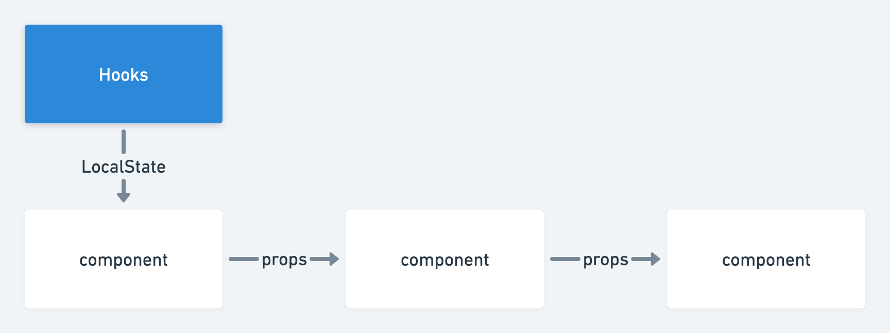
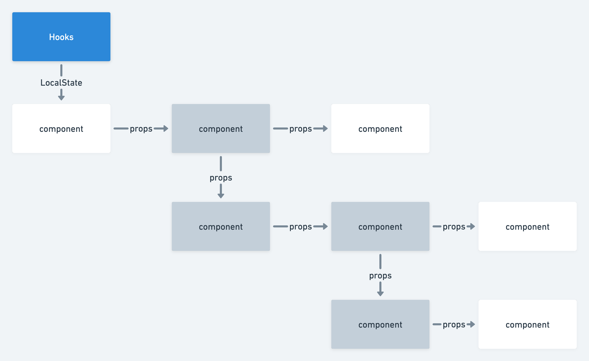
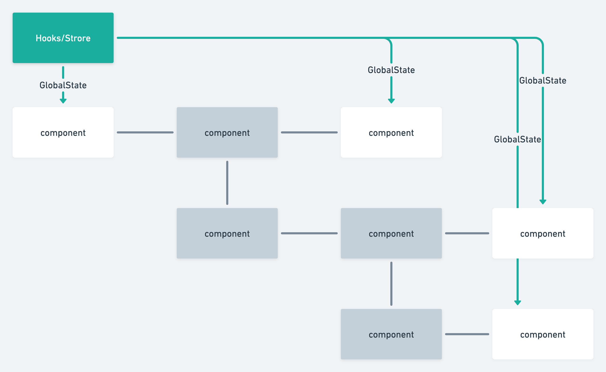

# 🗃️状態管理
* useState
* jotai

を利用します。

基本的にはuseStateを利用しpropsで子に受け渡しましょう。



しかしコンポーネントの切り分けや呼び出しがあると**propsリレー(props drilling)** が発生します。



これはその状態に関心がないコンポーネントにも状態がわたる、コンポーネントが密結合になるなどいくつか課題があります。  
そういった場合にはjotaiを用いてグローバルなStateを用いてください。



これにより灰色のコンポーネントには状態がわたらず `view-component` としてレイアウトに専念することができます。また、末端のコンポーネントも `model-component` として状態とその表示に専念できるでしょう。

jotaiはこのような半グローバルな状態共有やHooksと相性の良い状態管理ライブラリです。
類似ライブラリにRecoilがありますが、本テンプレートではよりシンプルなこちらを選定しました。  
https://jotai.org/  
キャラに独特の可愛さがありますね。

非常にシンプルでuseStateと似た使用感があります。
```tsx
//store.ts
import { atom } from 'jotai'

const countAtom = atom(0)

//Counter.tsx
import { useAtom } from 'jotai'

const Counter = () => {
   const [count, setCount] = useAtom(countAtom);
  return (
    <div>
      {count} <button onClick={() => setCount((c) => c + 1)}>+1</button>
    </div>
  );
}
```

グローバルStateはよく空間の汚染が懸念されます。
その際には状態を共有したい一つ上をProviderで囲ってあげましょう。
```tsx
import { Provider } from "jotai";

const SomeComponent = () => (
  <Provider>
    <SomeComponent />
  </Provider>
)
```
Providerは[こちらの動画](https://egghead.io/lessons/react-isolate-state-in-an-application-with-jotai-provider)で詳細な使い方が紹介されています。

一方で、これは注意しなくてはならない実装パターンです。せっかくglobalに使用したい状態があったとしても、Providerが存在するとその下では別の状態として扱われてしまいます。  
例を挙げると、「スナックバーの表示/非表示の状態が別ものとして扱われてしまう」ケースが挙げられます。

**基本は `Provider-less mode` で利用し、`feature/Component名`・`pages/Component名` 直下で定義し擬似的なスコープを獲得する。** 特殊なケースで `Provider` を利用すると良いでしょう。


## API通信とキャッシュ戦略

グローバルな状態とAPI通信は密接な関係にあります。例えば、「ユーザー情報を読み込んでその状態をキャッシュして使い回す」などです。  
Reactにはサーバー通信をキャッシュするために他にもメジャーな手段がります。

それが
* [react-query](https://react-query.tanstack.com/)
* [swr](https://swr.vercel.app/ja)
* [apollo client](https://www.apollographql.com/)
* [urql](https://formidable.com/open-source/urql/)

などです。[bulletproof-react](https://github.com/alan2207/bulletproof-react/blob/master/docs/state-management.md#server-cache-state)でも紹介されていますのでそちらもご覧ください。

上記のライブラリを端的にまとめると
1. 情報をフェッチする
2. 情報をライブラリ側にとっておく(キャッシュ化する)
3. 次回フェッチ時にキャッシュから情報を返す(無用なAPI通信を避け高速化を図る)

という役割を持つものとなり、状態をグローバルstateにsetする手間が減り便利です。  
一方で、キャッシュを使用することになりますので適切に扱わなければ古い情報が返ってくるなどの問題が生じます。

これらのライブラリの根底には `stale-while-revalidate` という考え方があります。正しく運用するためにも、導入前に一度触れておくと良いでしょう。[参考](https://zenn.dev/uttk/articles/b3bcbedbc1fd00#swr-%E3%81%A8%E3%81%AF%E4%BD%95%E3%81%8B%EF%BC%9F)

上記の中から、本リポジトリでは`Tanstack Query(React Query)`を採用しています。 
最も使われているデータフェッチングライブラリであることや、キャッシュのkeyとフェッチングの関数が独立しており細かい調整がしやすいことから選定しました。

使用方法は[公式ドキュメント](https://swr.vercel.app/ja/docs/getting-started)や以下が参考になります。
- [非同期処理に疲れた方に、ReactQueryの処方箋](https://zenn.dev/t_keshi/articles/react-query-prescription)
- [React Queryを使いこなすために試したこと](https://zenn.dev/himorishige/articles/76e903bc5a1aa2)
- [Filtering a fetched list from an API using React Query](https://stackoverflow.com/questions/66797655/filtering-a-fetched-list-from-an-api-using-react-query)


## コンポーネントの出し分けとSuspense
上記のライブラリはリクエストを飛ばす際に
* data
* error
* isLoading(fetching)

などの状態を返却してくれます。また、Reactはあくまで関数ベースです。

したがってコンポーネントの出しわけ、返却値を分岐させるには以下のようなパターンが使えます。
```jsx
function Example() {
  const { isLoading, error, data } = useQuery(['repoData'], () =>
    fetch('https://api.github.com/repos/tannerlinsley/react-query').then(res =>
      res.json()
    )
  )

  if (isLoading) return 'Loading...'

  if (error) return 'An error has occurred: ' + error.message

  return (
    <div>
      <h1>{data.name}</h1>
      <p>{data.description}</p>
      <strong>👀 {data.subscribers_count}</strong>{' '}
      <strong>✨ {data.stargazers_count}</strong>{' '}
      <strong>🍴 {data.forks_count}</strong>
    </div>
  )
}
```
[Tanstack Queryより引用](https://tanstack.com/query/v4/docs/overview)

エラーが生じたら失敗の表示を、データがなければローディングを返すという形ですね。

基本はこちらの実装で問題ありませんが、React 18から似た機能として `Suspense` が導入されています。また `Suspense` はパフォーマンス向上にも寄与します。[参考](https://qiita.com/uhyo/items/bbc22022fe846fd2b763)

実装方法としては
* 対応ライブラリを使用する
* Suspenseで囲む
* fallback用のコンポーネントを指定する

という程度ですので負担は大きくありません。  

```jsx
<Suspense fallback={<div>サスペンドしたらこれが表示される</div>}>
  {/* ↓サスペンドしなかったらこれが表示される */}
  <MyComponent />
</Suspense>
```
[ReactのSuspense対応非同期処理を手書きするハンズオン より引用](https://zenn.dev/uhyo/books/react-concurrent-handson/viewer/what-is-suspense)

しかし登場して間もない技術であること、内部実装が少々特異であるため導入はチームで話し合って決定しましょう。

<br>
<br>
<br>

[>>「🧪テスト」へ進む](./test.md)